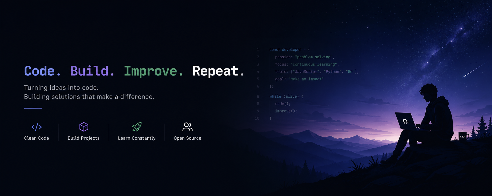

<div align="center">

#  Welcome to My Digital Workspace


</div>

---

<p align="center">
  
</p>

<h1 align="center">
Hi 👋 I'm <span style="color:#58A6FF;">Dhivakar</span>
</h1>

<h3 align="center">
Artificial Intelligence & Data Science Student
</h3>

<p align="center">


</p>

---

<div align="center">

### 💫 Developer Snapshot

<table>

<tr>

<td align="center">

🧠

**Learning**

Artificial Intelligence

</td>

<td align="center">

💻

**Building**

Python Projects

</td>

<td align="center">

🚀

**Current Goal**

AI Engineer

</td>

<td align="center">

🌱

**Status**

Always Improving

</td>

</tr>

</table>

</div>

---

<div align="center">

### ⚡ Technology Arsenal


</div>

---

<div align="center">


</div>

---

<div align="center">

> ### 💡 *"Every expert was once a beginner who refused to stop learning."*

</div>

---

<!-- ===================================================== -->
<!--             MODULE 2 : ABOUT ME                      -->
<!-- ===================================================== -->

#  About Me

> *"Code is where curiosity meets creativity."*

```python
from datetime import date

class Developer:

    def __init__(self):

        # Basic Information
        self.name = "Dhivakar S"
        self.role = "B.Tech Artificial Intelligence & Data Science Student"
        self.year = "Second Year"
        self.location = "Tamil Nadu, India"

        # Currently Building
        self.current_project = [
            "🏠 Smart Hostel Complaint Management System"
        ]

        # Learning Journey
        self.currently_learning = [
            "Machine Learning",
            "Flask Development",
            "REST APIs",
            "Data Structures & Algorithms",
            "Open Source"
        ]

        # Interests
        self.interests = (
            "Artificial Intelligence",
            "Backend Development",
            "Automation",
            "Problem Solving"
        )

        # Goal
        self.goal = (
            "Become an AI Engineer who builds "
            "real-world intelligent applications."
        )

    def life_philosophy(self):
        return (
            "Learn → Build → Improve → Repeat"
        )


if __name__ == "__main__":

    me = Developer()

    print(me.life_philosophy())

```

---

<div align="center">

## 🧩 Developer Snapshot

| 🎓 Education | 💻 Focus | 🌱 Currently Learning | 🚀 Goal |
|:------------:|:--------:|:---------------------:|:--------:|
| B.Tech AI & DS | Python & Flask Development | Machine Learning & Backend Engineering | AI Engineer |

</div>

---

## 🛠 Development Environment

```text
OS           :: Windows 11

Editor       :: Visual Studio Code

Language     :: Python

Framework    :: Flask

Database     :: SQLite

Version Ctrl :: Git & GitHub

Deployment   :: Render
```

---

<div align="center">

## ⚡ My Development Mindset

```
        Think 💡

            │

            ▼

      Design 📐

            │

            ▼

      Develop 💻

            │

            ▼

       Debug 🐞

            │

            ▼

      Deploy 🚀

            │

            ▼

      Learn 📚

            │

            └───────────────↺
```

</div>

---

<div align="center">

### 💭 Personal Philosophy

*"Technology changes every day, and that's exactly why I enjoy learning it every day."*

</div>

---

<!-- ===================================================== -->
<!--          MODULE 3 : PROJECTS • STATS • CONTACT        -->
<!-- ===================================================== -->

# 🚀 Featured Project

<div align="center">

## 🏠 Smart Hostel Complaint Management System

*A modern web application that simplifies hostel complaint reporting, tracking, and administration through a centralized digital platform.*


<br><br>

<a href="https://smart-hostel-complaint-management-system-evzo.onrender.com/">

</a>

&nbsp;

<a href="https://github.com/dhivakar007-ai/smart-hostel-complaint-management-system">

</a>

</div>

---

## ✨ Project Highlights

<table>

<tr>

<td width="50%">

### 👨‍🎓 Student Portal

- Secure Login
- Complaint Submission
- Complaint History
- Status Tracking
- User Dashboard

</td>

<td width="50%">

### 👨‍💼 Admin Portal

- Dashboard Analytics
- Complaint Management
- Status Updates
- Student Records
- Resolution Workflow

</td>

</tr>

</table>

---

# 📸 Project Gallery

<div align="center">


&nbsp;

&nbsp;


</div>

---

# 📊 GitHub Analytics

<div align="center">


</div>

<br>

<div align="center">


</div>

<br>

<div align="center">


</div>

---

# 🤖 AI-Assisted Development

Artificial Intelligence was used **responsibly as a development assistant** throughout this project.

It helped with:

- Debugging and troubleshooting
- Understanding programming concepts
- Improving code quality and maintainability
- UI/UX refinement
- Documentation preparation

> **AI accelerated development and learning, while all implementation, integration, testing, and deployment decisions were reviewed and completed as part of the project development process.**

---

# 🌱 Currently Exploring

<div align="center">

🧠 Artificial Intelligence & Machine Learning

⚙ Flask Backend Development

🌐 REST APIs

📊 Data Structures & Algorithms

☁ Cloud Deployment

🤝 Open Source Contributions

</div>

---

# 🤝 Let's Connect

<div align="center">

<a href="https://github.com/dhivakar007-ai">

</a>

&nbsp;&nbsp;

<a href="mailto:YOUR_EMAIL@gmail.com">

</a>

&nbsp;&nbsp;

<a href="https://www.linkedin.com/">

</a>

</div>

---

<div align="center">

## 💙 Thanks for Visiting

*"I believe every project is an opportunity to learn something new, improve existing skills, and create solutions that make a difference."*

<br>


</div>

---

<!-- ===================================================== -->
<!--          MODULE 3 : PROJECTS • STATS • CONTACT        -->
<!-- ===================================================== -->

# 🚀 Featured Project

<div align="center">

## 🏠 Smart Hostel Complaint Management System

*A modern web application that simplifies hostel complaint reporting, tracking, and administration through a centralized digital platform.*


<br><br>

<a href="https://smart-hostel-complaint-management-system-evzo.onrender.com/">

</a>

&nbsp;

<a href="https://github.com/dhivakar007-ai/smart-hostel-complaint-management-system">

</a>

</div>

---

## ✨ Project Highlights

<table>

<tr>

<td width="50%">

### 👨‍🎓 Student Portal

- Secure Login
- Complaint Submission
- Complaint History
- Status Tracking
- User Dashboard

</td>

<td width="50%">

### 👨‍💼 Admin Portal

- Dashboard Analytics
- Complaint Management
- Status Updates
- Student Records
- Resolution Workflow

</td>

</tr>

</table>

---

# 📸 Project Gallery

<div align="center">


&nbsp;

&nbsp;


</div>

---

# 📊 GitHub Analytics

<div align="center">


</div>

<br>

<div align="center">


</div>

<br>

<div align="center">


</div>

---

# 🤖 AI-Assisted Development

Artificial Intelligence was used **responsibly as a development assistant** throughout this project.

It helped with:

- Debugging and troubleshooting
- Understanding programming concepts
- Improving code quality and maintainability
- UI/UX refinement
- Documentation preparation

> **AI accelerated development and learning, while all implementation, integration, testing, and deployment decisions were reviewed and completed as part of the project development process.**

---

# 🌱 Currently Exploring

<div align="center">

🧠 Artificial Intelligence & Machine Learning

⚙ Flask Backend Development

🌐 REST APIs

📊 Data Structures & Algorithms

☁ Cloud Deployment

🤝 Open Source Contributions

</div>

---

# 🤝 Let's Connect

<div align="center">

<a href="https://github.com/dhivakar007-ai">

</a>

&nbsp;&nbsp;

<a href="mailto:YOUR_EMAIL@gmail.com">

</a>

&nbsp;&nbsp;

<a href="https://www.linkedin.com/">

</a>

</div>

---

<div align="center">

## 💙 Thanks for Visiting

*"I believe every project is an opportunity to learn something new, improve existing skills, and create solutions that make a difference."*

</div>

---

<div align="center">


*"Building today. Learning forever."*

</div>
